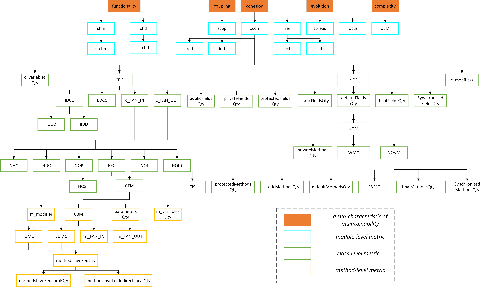

## Forest Structure

Based on the maintainability model defined by ISO/IEC 25010, we construct a forest structure as a knowledge base, combing widely-adopted code-level metrics from the developer side. All the collected metrics correspond to the nodes in the forest structure, where each link between nodes denotes their relation.

## Metrics

The forest Structure contains four granularity maintainability metrics, and the number of metrics provided by each granularity is as follows:

| granularity | number |
| ----------- | ------ |
| project     | 11     |
| module      | 12     |
| class       | 42     |
| method      | 12     |

The metrics of all granularity are explained as follows.

- project

  | metric | full name                    | description                                                  | source |
  | ------ | ---------------------------- | ------------------------------------------------------------ | ------ |
  | score  | -                            | Integrate module-level metrics to obtain a comprehensive score of maintainability | [3]    |
  | CHM    |                              | The average cohesion of all modules in the project at the message level. | [4]    |
  | CHD    |                              | The average cohesion of all modules in the project at the domain level. | [4]    |
  | SMQ    | structural modularity        | The degree of structural modularization. The higher SMQ, the higher modularity of the module. | [4]    |
  | SPREAD | -                            | Measure the number of cross-module co-change clusters in the evolution process of entities. The smaller SPREAD, the better overall modularity. | [5]    |
  | FOCUS  | -                            | Measure the degree of good modularity. The larger FOCUS, the better overall modularity. | [5]    |
  | ICF    | intra co-change frequency    | The average value of co-change frequency within the evolution of all modules. The higher ICF, the more likely the entities in the overall module will evolve together. | [4]    |
  | ECF    | external co-change frequency | Average value of external co-chage frequency of all modules. The lower ECF, the more likely the entities across the module boundary will evolve independently. | [4]    |
  | REI    | ratio of ecf to icf          | The average value of the ratio of the external covariant frequency to the internal covariant frequency of all modules. The lower REI, the lower the possibility that different modules can be modified together. Each module is more likely to evolve and maintain independently. | [4]    |
  | ODD    | out-degree dependence        | The larger ODD, the higher the overall coupling degree of other modules, and the higher the dynamic interaction between modules. | [4]    |
  | IDD    | in-degree dependence         | The larger IDD, the higher the degree of overall coupling, and the higher the degree of dynamic interaction between modules. | [4]    |

- module

  | metric | description                                                  | source |
  | ------ | ------------------------------------------------------------ | ------ |
  | scoh   | The larger scoh, the greater structural cohesion within the module. | [4]    |
  | scop   | The larger scop, the greater structural coupling between modules. | [4]    |
  | odd    | The larger odd, the higher degree of coupling between the module and other modules. | [4]    |
  | idd    | The larger idd, the higher degree of coupling of the module. | [4]    |
  | spread | Measure the number of co-change clusters contacted by the module during the evolution process. The smaller spread, the better modularity. | [5]    |
  | focus  | The degree to which entities in the measurement module focus on their own evolution during the evolution process. The larger focus, the better modularity. | [5]    |
  | icf    | The higher icf, the more likely the entities in the module will evolve together. | [4]    |
  | ecf    | The lower ecf, the more likely the entities that cross the module boundary will evolve independently. | [4]    |
  | rei    | The lower rei, the lower the possibility of modifying different modules together, and the more likely the modules will evolve and maintain independently. | [4]    |
  | DSM    | The larger DSM, the module becomes more complex , and the higher possibility of external coupling. | QMOOD  |
  | chm    | The larger chm, the higher cohesion of the module in the message layer. | [4]    |
  | chd    | The larger chd, the higher cohesion of the module at the domain level. | [4]    |

- class

  | metric                 | description                                           | source |
  | ---------------------- | ----------------------------------------------------- | ------ |
  | CIS                    | Number of public interfaces in the class              | QMOOD  |
  | NOM                    | Total number of methods in the class                  | QMOOD  |
  | NOP                    | Number of polymorphic methods                         | QMOOD  |
  | NAC                    | Number of class ancestors                             | QMOOD  |
  | NDC                    | Number of class derivations                           | QMOOD  |
  | NOI                    | Number of import                                      | ours   |
  | NOID                   | Number of imported                                    | ours   |
  | CTM                    | coupling with message                                 | CK     |
  | IDCC                   | Number of coupling classes in the module              | QMOOD  |
  | IODD                   | Number of other classes coupled in the module         | ours   |
  | IIDD                   | Number of coupling by other classes in the module     | ours   |
  | EDCC                   | Number of coupling classes outside the module         | QMOOD  |
  | c_FAN_IN               | Number of class in-degree                             | CK     |
  | c_FAN_OUT              | Number of class out-degree                            | CK     |
  | CBC                    | Number of class dependencies                          | CK     |
  | c_chm                  | The functional cohesion of class at the message layer | [4]    |
  | c_chd                  | The functional cohesion of class at the domain layer  | [4]    |
  | c_variablesQty         | Number of variables in the class                      | CK     |
  | privateMethodsQty      | Number of private methods                             | CK     |
  | protectedMethodsQty    | Number of protected methods                           | CK     |
  | staticMethodsQty       | Number of static methods                              | CK     |
  | defaultMethodsQty      | Number of default methods                             | CK     |
  | abstractMethodsQty     | Number of abstract methods                            | CK     |
  | finalMethodsQty        | Number of final methods                               | CK     |
  | synchronizedMethodsQty | Number of synchronized methods                        | CK     |
  | publicFieldsQty        | Number of public fields                               | CK     |
  | privateFieldsQty       | Number of private fields                              | CK     |
  | protectedFieldsQty     | Number of protected fields                            | CK     |
  | staticFieldsQty        | Number of static fields                               | CK     |
  | defaultFieldsQty       | Number of default fields                              | CK     |
  | finalFieldsQty         | Number of final fields                                | CK     |
  | synchronizedFieldsQty  | Number of synchronized fields                         | CK     |
  | RFC                    | Response for class                                    | CK     |
  | NOF                    | Number of fields                                      | CK     |
  | NOVM                   | Number of visible methods                             | CK     |
  | NOSI                   | Number of static method invokes                       | CK     |
  | TCC                    | Tight class cohesion                                  | CK     |
  | LCC                    | Loose class cohesion                                  | CK     |
  | LCOM                   | Lack cohesion of methods                              | CK     |
  | LOCM*                  | Lack cohesion of methods                              | CK     |
  | WMC                    |                                                       | CK     |
  | c_modifiers            |                                                       | CK     |

- method

  | metric                         | description                                   | source |
  | ------------------------------ | --------------------------------------------- | ------ |
  | startLine                      | Method start position                         | ours   |
  | CBM                            | Number of method dependencies                 | CK     |
  | m_FAN_IN                       | method fan-in                                 | CK     |
  | m_FAN_OUT                      | method fan-out                                | CK     |
  | IDMC                           | Number of coupling methods within the module  | QMOOD  |
  | EDMC                           | Number of coupling methods outside the module | QMOOD  |
  | methodsInvokedQty              | Number of methods invokes                     | CK     |
  | methodsInvokedLocalQty         | Number of methods local invokes               | CK     |
  | methodsInvokedIndirectLocalQty | Number of methods indirect local invokes      | CK     |
  | m_variablesQty                 | Number of variables in the method             | CK     |
  | parametersQty                  | Number of method parameters                   | CK     |
  | m_modifier                     | -                                             | CK     |

## Module-level Metrics Detail

### functionality

- chm
- chd

### coupling

- scop
- scoh
- odd
- idd

### cohesion

- scoh

### evolution

- rei
- ecf
- icf
- spread
- focus

### complexity

- DSM

## References

[1] S. R. Chidamber and C. F. Kemerer, “A metrics suite for object oriented design,” IEEE Transactions on software engineering, vol. 20, no. 6, pp. 476–493, 1994.

[2] J. Bansiya and C. G. Davis, “A hierarchical model for object-oriented design quality assessment,” IEEE Transactions on software engineering,vol. 28, no. 1, pp. 4–17, 2002.

[3] C. Zhong, S. Li, H. Zhang, and C. Zhang, “Evaluating granularity of microservices-oriented system based on bounded context,” Journal of Software, vol. 30, no. 10, pp. 3227–3241, 2019.

[4] W. Jin, D. Zhong, Y. Zhang, M. Yang, and T. Liu, “Microservice maintainability measurement based on multi-sourced feature space,”Journal of Software, vol. 32, no. 5, pp. 1322–1340, 2021.

[5] L. L. Silva, M. T. Valente, and M. d. A. Maia, “Assessing modularity using co-change clusters,” in Proceedings of the 13th international conference on Modularity, pp. 49–60, 2014.

